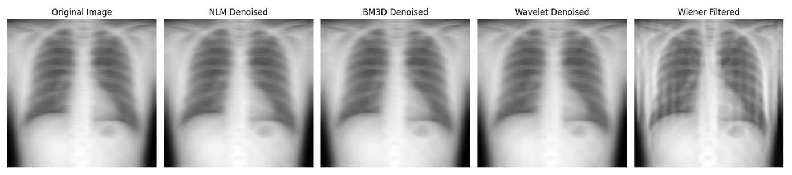
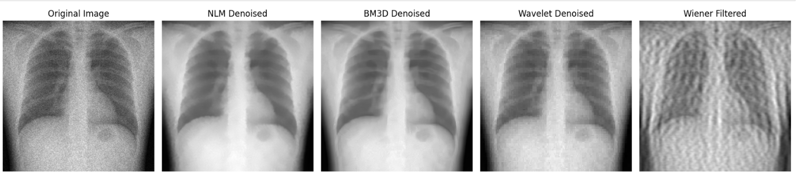
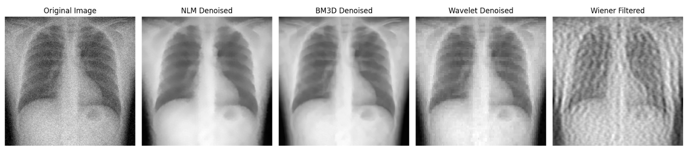

# Medical Image Denoising and Restoration

This project focuses on restoring real-world noisy grayscale medical images (e.g., X-rays) using classical denoising techniques in Python. Without introducing synthetic noise, it applies various filtering methods to reduce motion blur, Gaussian noise, and other common artifacts, improving image clarity for better medical diagnosis.

---

## 📌 Features

- Denoising real medical images without artificial noise addition
- Techniques implemented:
  - Non-Local Means (NLM)
  - BM3D (Block Matching and 3D Filtering)
  - Wavelet Denoising
  - Wiener Filtering
- Visual comparison of denoised outputs
- Implemented in Python using OpenCV, scikit-image, and bm3d

---

## 📁 File Structure

```📂 medical-image-denoising/
├── xray_motion_blur.png # Input image with real noise
├── denoise_image.ipynb # Jupyter Notebook with implementation
└── README.md # Project description file
```


---

## 🧪 Dependencies

Install the required Python libraries:
`pip install opencv-python matplotlib scikit-image bm3d`


## 🚀 How to Run
``
1. Place your noisy grayscale image (e.g., xray_motion_blur.png) in the same directory as the notebook.
2. Open denoise_image.ipynb using Jupyter Notebook or VS Code.
3. Run the notebook step by step to apply denoising techniques.
4. Compare original and denoised results visually.

## 📊 Techniques Overview

| Method            | Strengths                                        |
| ----------------- | ------------------------------------------------ |
| Non-Local Means   | Good for random and quantum noise                |
| BM3D              | Excellent for Gaussian noise                     |
| Wavelet Denoising | Preserves image structure, suppresses soft noise |
| Wiener Filtering  | Effective for motion blur and linear noise       |

## 📷 Output Preview







## 📜 License

This project is intended for educational and research purposes only.


TEAM MEMBERS : 
4SO22CD039  : REONEY IRAL MADTHA
4SO22CD040  : RICHELLE SALDANHA
4SO22CD047  : SHEROL DSOUZA


